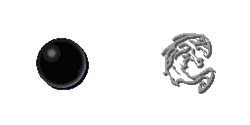
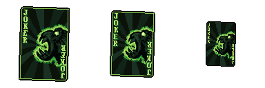

# Blightfall - The Ultimate Death Knight Experience

Timing helper for Unholy Death Knights in World of Warcraft (Retail).

Tracks the **Dark Transformation → Soul Reaper → Blightfall → Putrefy** sequence with pixel-art animations: each spell loads while you wait, shows a ready loop when it's time to cast, and plays an effect when you use it.

## Features



- Loading animation stretched to your chosen timer, then Ready/Idle until you cast, then an OnUse effect.
- Putrefy reminder animations after Blightfall; it leaves after 5 seconds if not cast. Pick Normal, Small or Mini (simplified) card size in the settings.

  

- **Self-correcting timers.** If a mechanic or a boss move makes you cast Soul Reaper late, Blightfall's timer shortens to match instead of running its full length and costing you damage.
- Talent aware. Driven only by your own casts, so it keeps working in combat.
- Optional countdown text and spell name with custom fonts, colours, shadow and position.
- Sound presets for each moment of the sequence, plus spoken countdown (voice files or WoW text-to-speech).
- Combo preset with a Perfect Combo celebration when the whole sequence is cast on time.
- Draggable minimap button.

## Commands

| Command | Action |
|---|---|
| `/bf` or `/blightfall` | Open / close settings |
| `/bf move` | Unlock the display to drag it |
| `/bf lock` | Lock the display |
| `/bf test` | Preview Soul Reaper |
| `/bf stop` | Stop preview |

## Installation

### CurseForge (recommended)

You can download and update Blightfall directly from [CurseForge](https://www.curseforge.com/wow/addons/blightfall-the-ultimate-death-knight-experience), or from the CurseForge app by searching for *Blightfall - The Ultimate Death Knight Experience*. The app keeps it up to date for you.

### Manual install

Download **Blightfall-vX.Y.Z.zip** from the [latest release](https://github.com/esalgado23/Blightfall/releases/latest) and extract it into:

```
World of Warcraft\_retail_\Interface\AddOns
```

You should end up with `AddOns\Blightfall\Blightfall.toc`. Restart WoW, then type `/bf`.

> Use the release zip, not the green **Code → Download ZIP** button. The animations and sounds are built when a release is made and are not stored in the repository, so a source download will not run.

## Building the media (maintainers)

Everything under `Media/` is generated from `art/` and is not committed; the release workflow builds it.

- `python tools/build_anims.py` (needs Pillow) turns the sprite sheets in `art/src` into `Media/Anim/*.tga` and `AnimData.lua`.
- `python tools/build_sounds.py` (needs soundfile) copies `art/sounds` into `Media/Sounds`, trimming any leading silence so a sound lands the moment it is meant to.
- `python tools/check.py` (needs luaparser) syntax-checks the Lua and confirms the media it references exists.

## Releasing (maintainers)

Push a tag such as `v1.0.1`. GitHub Actions packages the addon and uploads it to CurseForge and GitHub Releases. Add release notes to `CHANGELOG.md` before tagging.
